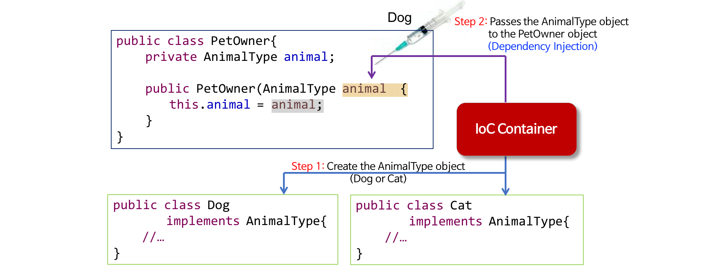

# Dependency Injection
* Object Dependencies
* Dependency Injection
* Spring Container

## Object Dependencies (객체 의존성)
현재 객체가 다른 객체와 상호작용(참조)하고 있다면 현재 객체는 다른 객체에 의존성을 갖는다.
```java
public class PetOwner {
  
  private AnimalType animal;
  
  public PetOwner() {
    this.animal = new Dog();
  }
  
}
```
* **PetOwner 객체는 AnimalType 객체(Dog)에 의존한다.**
    > PetOwner 생성자에서 ```new Dog();```를 통해 Dog 에 의존성을 갖는다.
* **이 접근법의 문제점 (의존성이 위험한 이유)**
    > PetOwner 객체는 AnimalType 객체의 생성을 제어하기 때문에 두 객체 간에는 긴밀한 결합(tight coupling)이 생기고,<br>
    tight coupling 에 따라 AnimalType 객체를 변경하면 PetOwner 객체도 변경된다.<br><br>
    즉, 하나의 모듈이 바뀌면 의존한 다른 모듈까지 변경되어야 한다.<br>
    또한, 두 객체 사이의 의존성이 존재하면 Unit Test 작성이 어려워진다.
    
---
    
## Dependency Injection (의존성 주입)
객체 자체가 아니라 Framework 에 의해 객체의 의존성이 주입되는 설계 패턴
* Framework 에 의해 동적으로 주입되므로 여러 객체 간의 결합이 줄어든다.
* Dependency Injection 은 Spring Framework 에서 지원하는 IoC 의 형태

* 설정에 명시된대로 Container 가 bean 객체를 생성하고, 종속성 주입을 수행한다.
* DI(의존성 주입)과 IoC(제어의 역전)은 같은 의미로 사용된다.
    > IoC 는 DI 를 통해 달성된다.
* IoC(제어의 역전): 프로그램 제어권을 framework 가 가져가는 것
    * 개발자가 모든 제어의 중심이지만 코드 전체에 대한 제어는 framework 가 한다.
    * 개발자가 설정(xml, annotation 등)만 하면 Container 가 알아서 처리한다.
    * 즉, 우리는 framework 속에서 프로그래밍 하는 것
    
### 장점
* **Reduced Dependencies**
    > 종속성이 감소한다.<br>
    components 의 종속성이 감소하면 변경에 민감하지 않다.
* **More Reusable Code**
    > 재사용성이 증가한다.<br>
    일부 인터페이스의 다른 구현이 필요한 경우, 코드 변경 없이 해당 구현을 사용하도록 components 를 구성할 수 있다.
* **More Testable Code**
    > 더 많은 테스트 코드를 만들 수 있다.
    
    > Mock 객체는 실제 구현의 테스트로 사용되는 객체<br>
    종속성을 components 에 주입할 수 있는 경우, 이러한 종속성의 Mock 구현을 주입할 수 있다.<br>
    예를 들어, Mock 객체가 올바른 객체를 반환할 때, null 을 반환할 때, 예외가 발생할 때 모두 처리할 수 있다.
* **More Readable Code**
    > 코드를 읽기 쉬워진다.<br>
    components 의 종속성을 보다 쉽게 파악할 수 있으므로 코드를 쉽게 읽을 수 있다.
    
### 간단한 예시

1. AnimalType 에 대한 구체적인 Class 를 생성한다.
    > Dog, Cat Class
2. PetOwner 객체에 AnimalType 객체를 전달한다.
    > Constructor Injection<br>
    생성자를 통한 전달<br>
    <constructor-arg ref="cat"></constructor-arg>
    
    > Method(Setter) Injection<br>
    setter() 를 통한 전달<br>
    <property name="myName" value="poodle"></property>
    
    > Field Injection<br>
    멤버 변수를 통한 전달
    
**개발자가 할 일**
* 주입할 것에 대한 Class 를 작성(Dog, Cat 등)하는 것
* 어떤 것을 주입할 것인지 결정할 설정 파일(xml, annotation 등)을 작성하는 것
* 즉, 코드는 전혀 변화가 없다.

---

## Spring Container
Spring Container 는 DI 를 사용하여 응용 프로그램을 구성하는 bean 객체를 관리한다.

### 역할
bean 을 포함하고 관리하는 책임이 있다.
1. 객체(bean) 을 생성하고
2. 객체들을 함께 묶고di
3. 객체들을 구성하고
4. 객체들의 전체 수명주기 (LifeCycle) 를 관리

### 설정 방법
Spring Container metadata 설정 방법 (3가지)
1. XML
    * Bean Definition
    * Dependency Injection
2. Java Annotations
3. Java Code

### 유형
Spring Container 의 2가지 유형
* **BeanFactory**
    > 주로 단순한 DI 에서만 사용한다.<br>
    XMLBeanFactory
* **ApplicationContext**
    > Resources 가 제한되어 있지 않은 모든 곳에서 사용한다.<br>
    ClassPathXmlApplicationContext
```java
/**
* main 함수에서 Container 생성
* 설정 파일은 인자로 넣고, 해당 설정 파일에 맞게 bean 을 생성
*/
ApplicationContext context = new ClassPathXmlApplicationContext("com/example/di/beans/bean.xml");
// getBean()을 통해 bean 의 주소값을 가져온다.
HelloWorld obj = (HelloWorld) context.getBean("helloWorld");
```

---

## Spring Container 와 DI 의 예시

* [AnimalType-Interface](./src/main/java/com/example/di/AnimalType.java)
* AnimalType 에 대한 구체적인 Class
    * [Cat](./src/main/java/com/example/di/Cat.java)
    * [Dog](./src/main/java/com/example/di/Dog.java)
* [PetOwner Class](./src/main/java/com/example/di/PetOwner.java)
* MainApp Class
```java
import org.springframework.context.support.ClassPathXmlApplicationContext;

public class MainApp {
  public static void main(String[] args) {
    ClassPathXmlApplicationContext context = new ClassPathXmlApplicationContext("com/example/di/beans/animal.xml");
    PetOwner person = (PetOwner) context.getBean("petOwner");
    person.play();
    context.close();
  }
}
```

* **Configure beans and dependencies (animal.xml)**
    * Bean Definition
    * Dependency Injection
```xml
<beans xmlns="http://www.springframework.org/schema/beans"
                ...

    <bean id="dog" class="com.example.di.dto.Dog">
        <property name="myName" value="poodle"></property>
    </bean>
    
    <bean id="cat" class="com.example.di.dto.Cat">
        <property name="myName" value="kikat"></property>
    </bean>
    
    <bean id="petOwner" class="com.example.di.dto.PetOwner">
        <constructor-arg ref="cat"></constructor-arg>
    </bean>
```
* ```<bean id="dog" class="com.example.di.dto.Dog">```
    * id="dog": 객체 이름
* ```<property name="myName" value="poodle"></property>```
    * value 의 값을 해당 클래스에 선언한 setter 의 인자에 주입
* ```<bean id="petOwner" class="com.example.di.dto.PetOwner">```
    * id="petOwner": 객체 이름
* ```<constructor-arg ref="cat"></constructor-arg>```
    * 해당 클래스의 생성자의 인자에 "cat" 객체 주입
    * ref="dog" 로 변경하더라도 다른 Java Code 에 영향을 미치지 않는다.
* 설정 파일만 변경하면 알아서 의존성을 주입한다.
* 설정 파일에 bean 객체를 정의/등록 해놓으면 알아서 생성한다.
* 객체는 ref, String 은 value 로 설정한다.